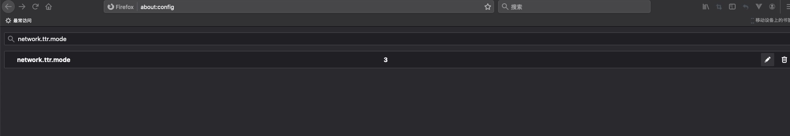

# 设置火狐浏览器支持 handshake 域名的方法

## 设置 nextdns 并获取 解析地址

* 打开 https://nextdns.io/ , 点击 Try it now free.

* 选择最下边配置面板里的 Browsers 。 如果你英语好，直接看说明好了。 复制 DNS-over-HTTPS 后边的地址 。 

* 选择最右侧的Settings 面板，把页面一直往下拉

* 勾选对应的 handshake 解析开关

## 设置火狐浏览器

* 打开火狐首选项，拉到最下边，点击网络设置模块里的设置按钮

* 弹出的设置菜单里，按照如下设置 

  * 勾选 启用 HTTPS 的DNS 
  * 提供商下拉框，选择自定义
  * 自定义后边的地址栏，粘贴前边复制的地址。
  设置完成，点击保存。

* 火狐地址栏里输入 about:config  ， 点击接受风险并继续

* 搜索栏里，输入 network.ttr.mode ，设置对应的值为3 

* 如果搜索不知道对应的值，那么 ，按照如下的选择，新建值,
类型选择数字， 点击 + ， 弹出的框里输入3 即可。 

## 完成设置，打开 handshake 网页。 

